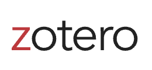

  

    <h1>
    
    Zotero: A short introduction</h1> 
    <h5>Sign up for free today</h5>
  
  

Here at MIT, you have access to an unlimited license of <a href="https://www.zotero.org/">Zotero</a>.  
Zotero is an <b> open source </b> citation management system.  
That means you can use it to keep track of your references.
